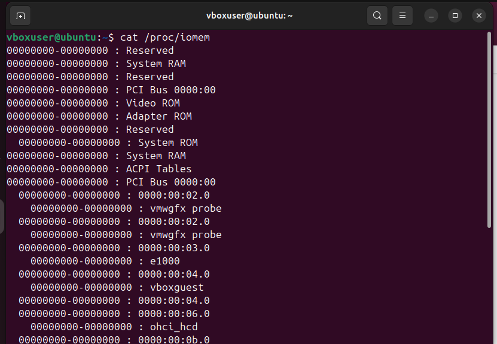
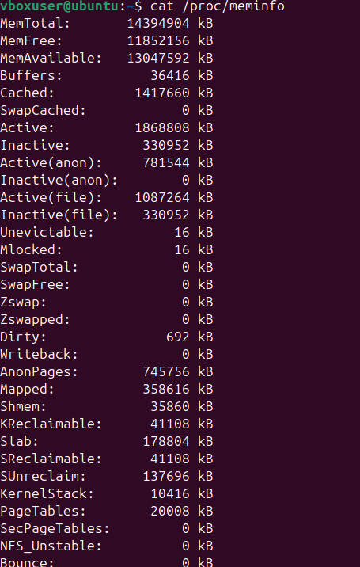
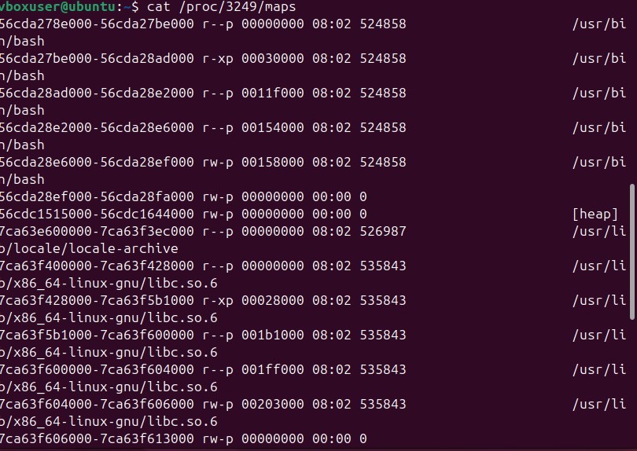
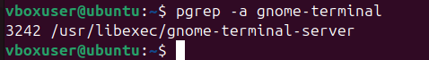
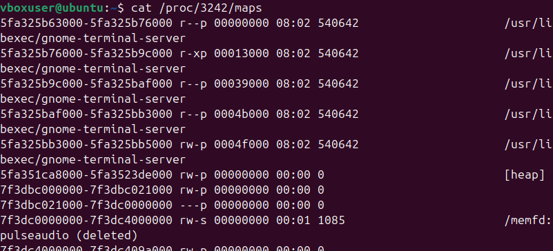
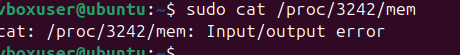

# Управление памятью в Linux

## `/proc/iomem`

Просмотр карты адресного пространства памяти:



## `/proc/meminfo`

Просмотр сведений об использовании памяти:



## Процесс `bash`

```bash
pgrep bash
3249
```

Карта памяти процесса:



Попытка чтения памяти процесса:

```bash
cat /proc/3249/mem
cat: /proc/3249/mem: Input/output error
```

## Процесс `gnome-terminal-server`

Получен PID процесса:



Карта памяти процесса `/proc/3242/maps`:



Попытка чтения памяти процесса:

```bash
cat /proc/3242/mem
cat: /proc/3242/mem: Input/output error
```


